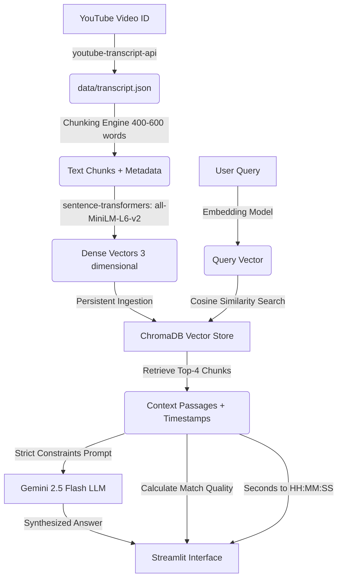

# Sportomic AI Lab Internship Assignment (Option 3 - Podcast Q&A Bot)

A production-quality Retrieval-Augmented Generation (RAG) system built to search, retrieve, and answer questions based exclusively on the YouTube podcast:
**"Elon Musk × Nikhil Kamath | People by WTF Ep.16"** (Video ID: `Rni7Fz7208c`).

This application uses local embeddings for semantic search, an embedded vector store for document retrieval, and Gemini 2.5 Flash for high-quality, hallucination-free Q&A. It maps every answer to the exact timestamp in the podcast, providing a clickable link that jumps directly to the moment in the YouTube video.

---

## 🌟 Key Features

1. **Precision Retrieval**: Custom word-based text chunking (400-600 words) with overlapping windows to preserve contextual flow and prevent information loss at chunk boundaries.
2. **Local Semantic Indexing**: Generates dense 384-dimensional vectors using `all-MiniLM-L6-v2` locally (no API keys required for embedding generation).
3. **Embedded Vector Database**: ChromaDB running in persistent mode using Cosine Similarity for normalized matching scores.
4. **Hallucination Protection**: A strict RAG prompt layout instructing the Gemini 2.5 Flash model to answer *only* from the retrieved transcripts. If the topic is absent, it responds with the exact fallback phrase: *"This topic was not found in the podcast."*
5. **Precise Timestamp System**: Stores starting segment offsets to compute the exact video timestamps (in `HH:MM:SS` format) and generates YouTube deep-links (`&t=X` parameter).
6. **Premium Streamlit UI**: Custom dark-mode-aligned UI with neon teal accents, glassmorphic cards, dynamic progress bars, quick-select example questions, and full source-chunk inspectability.

---

## 🏗️ System Architecture



---

## 📁 Project Directory Structure

```
sportomic-podcast-bot/
├── config.py           # Global settings, model config, and directory paths
├── utils.py            # Logging setup, HH:MM:SS converters, YouTube link builders
├── transcript.py       # Programmatic YouTube transcript downloading and caching
├── embeddings.py       # Segment chunking, model embedding, and database indexing
├── rag.py              # Semantic retrieval, confidence scoring, and Gemini RAG pipeline
├── app.py              # Modern Streamlit UI and interactive frontend
├── requirements.txt    # Defined python package dependencies
├── .env.example        # Reference environment variables file
├── README.md           # Technical documentation and guides
├── INTERVIEW_PREP.md   # Extensive technical concept and Q&A guide
│
├── data/
│   ├── transcript.json # Extracted transcript (generated by transcript.py)
│   └── banner.png      # Generated premium banner image for Streamlit header
│
└── chroma_db/          # Persistent ChromaDB database folder (created by embeddings.py)
```

---

## 🚀 Quick Start Guide

### Prerequisites
- **Python 3.11+**
- **Git**

### 1. Clone & Set Up Workspace
Navigate to the directory in your terminal:
```bash
cd "/Users/adarsh/Desktop/podcast bot "
```

### 2. Create Virtual Environment & Install Dependencies
Setting up a local environment ensures version pinning:
```bash
# Create Python 3.11 Virtual Environment
python3.11 -m venv .venv

# Activate the Virtual Environment
source .venv/bin/activate

# Install the dependencies
pip install -r requirements.txt
```

### 3. Environment Configuration
Copy the `.env.example` to `.env`:
```bash
cp .env.example .env
```
Open `.env` and add your **Gemini API Key**:
```env
GEMINI_API_KEY=AIzaSy...your_gemini_api_key...
```
*(If you do not have an API key, get one for free at [Google AI Studio](https://aistudio.google.com/).)*

### 4. Fetch the Transcript
Download the podcast transcript directly from YouTube's server and save it to the local cache:
```bash
python transcript.py
```
*Output file: `data/transcript.json`*

### 5. Build the Vector Index
Chunk the text, generate embeddings locally, and create the vector database index:
```bash
python embeddings.py
```
*Output folder: `chroma_db/`*

### 6. Launch the Web Application
Start the Streamlit server:
```bash
streamlit run app.py
```
A browser window should automatically open to `http://localhost:8501`. If it doesn't, follow the link displayed in your terminal.

---

## ⚡ Deployment to Streamlit Cloud

To host this project on Streamlit Cloud (free hosting) so interviewers can test it live:

1. **Push your code to a GitHub Repository** (ensure you do **not** check in your `.env` or `chroma_db/` folders. Add them to `.gitignore`).
2. Go to [Streamlit Share](https://share.streamlit.io/) and click **New App**.
3. Select your repository, branch, and set the entry file path to `app.py`.
4. Open **Advanced Settings** -> **Secrets**.
5. Paste your environment secrets there:
   ```toml
   GEMINI_API_KEY = "AIzaSy..."
   ```
6. Click **Deploy**. Streamlit Cloud will run `pip install -r requirements.txt` automatically.
7. **Important**: Because Streamlit Cloud runs in an ephemeral container, you should commit your cached transcript file `data/transcript.json` to GitHub so that the app loads the data out-of-the-box, and writes/initializes ChromaDB on the fly during deployment startup, or use the dynamic setup in our `app.py` which will run smoothly.

---

## 🧪 Verification Questions (Test Cases)

Here are 10 reference questions to test the robustness of the system:

| # | Test Question | Discussion Theme | Expected Output Type |
|---|---|---|---|
| 1 | *What is Elon Musk's view on artificial intelligence?* | AI regulation / Risks | Comprehensive answer + timestamp near beginning |
| 2 | *What is discussed regarding the colonization of Mars?* | SpaceX / Multiplanetary life | Discussion of Fermi Paradox / Mars civilization |
| 3 | *What does Elon Musk say about the future of work and jobs?* | AI replacing work / UBI | Concept of abundant goods and jobs as choices |
| 4 | *Does Elon Musk believe in aliens or extraterrestrial life?* | Fermi Paradox / Area 51 | No evidence yet, but hopes they exist |
| 5 | *How does Nikhil Kamath introduce the guest?* | Intro / Podcast opening | Welcomes Elon Musk and sets scope of discussion |
| 6 | *What are Elon's views on the educational system?* | Rote learning vs critical thinking | Learning should be gamified; physics first principles |
| 7 | *How does Elon Musk view demographic declines?* | Global birth rates | Declining birth rates is the biggest risk to humanity |
| 8 | *What is discussed about Neuralink and its goals?* | Brain-computer interfaces | Restoring motor function / high bandwidth interface |
| 9 | *What is Elon's perspective on regulatory frameworks for AI?* | AI safety | Need a referee for AI, similar to sports regulators |
| 10 | *What does Elon say about China's engineering talent?* | Manufacturing / Talent pools | Praises Chinese engineering capability and drive |
| 11 | *What is Nikhil Kamath's favorite color?* | Out of context | **"This topic was not found in the podcast."** |
